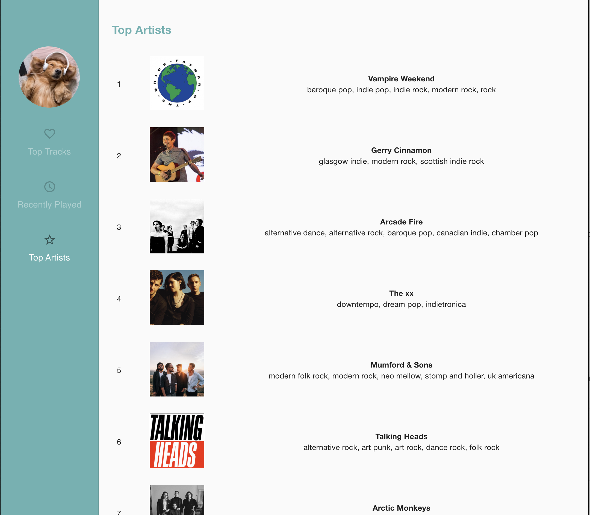
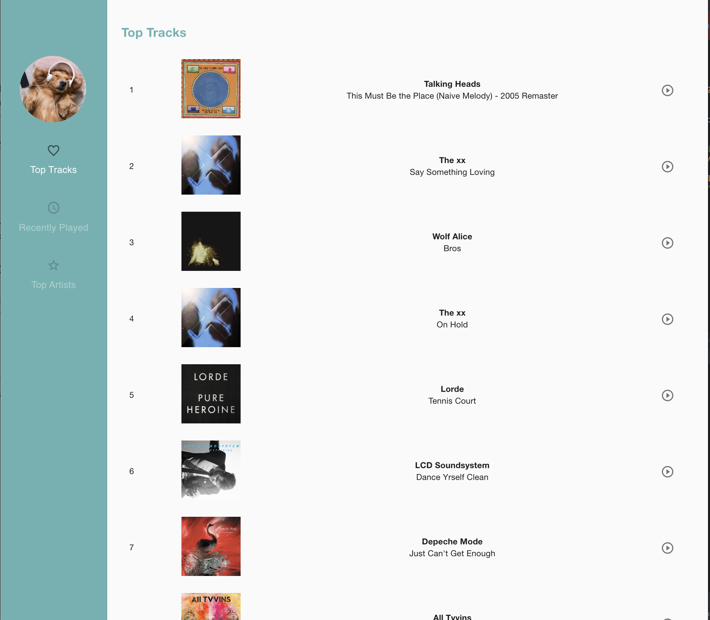

## Christine's Tunes

This React app uses the Spotify Web API to display data about your most listened to tracks and artists from Spotify. 
The app follows Authorization Code Flow to authorize user access. A Spotify account is required.

View your most played artists

and your favourite tracks of the year

------------------

In the project directory, you can run:

### `yarn start`

Runs the app in the development mode. 
Open [http://localhost:3000](http://localhost:3000) to view it in the browser.
